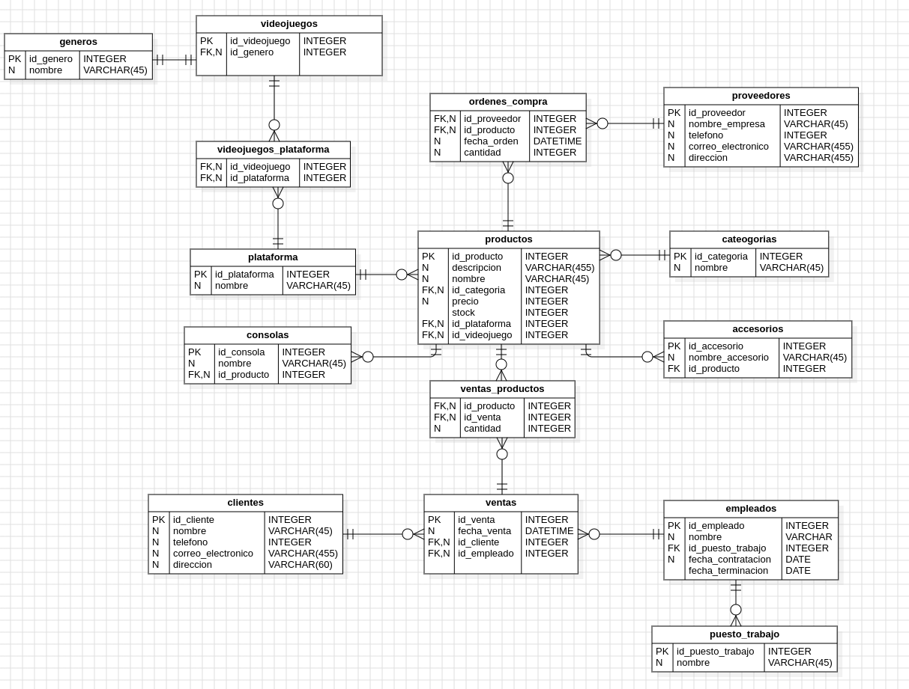

# 🎮 VirtualVortex 🖥️

Este proyecto consiste en una base de datos relacional diseñada para gestionar informacion relacionada con la venta de videojuegos, consolas, accesorios, clientes, empleados y proveedores. La base de datos esta diseñada en MySQL y contiene varias tablas interrelacionadas que almacenan datos clave para el funcionamiento de una tienda de videojuegos.

## 🗂️ Estructura de la Base de Datos

La base de datos esta compuesta por las siguientes tablas:

- **`productos`**: Almacena informacion sobre los productos (videojuegos, consolas y accesorios) disponibles en la tienda. Cada producto tiene un identificador unico, nombre, descripcion, categoria, precio, stock y relaciones con plataformas y generos en el caso de los videojuegos.
  
- **`categorias`**: Define las diferentes categorias de productos (videojuegos, consolas, accesorios).

- **`videojuegos_plataforma`**: Relaciona los videojuegos con las plataformas en las que est谩n disponibles.

- **`plataforma`**: Almacena las distintas plataformas (PlayStation, Xbox, PC, etc.) en las que pueden estar disponibles los videojuegos.

- **`generos`**: Almacena los generos de los videojuegos (aventura, accion, deportes, etc.).

- **`consolas`**: Informacion sobre las consolas disponibles, incluyendo el nombre de cada consola.

- **`accesorios`**: Almacena informacion sobre los diferentes accesorios y a que producto estan relacionados.

- **`clientes`**: Contiene informacion sobre los clientes de la tienda, como su identificador unico, nombre, correo electronico, direccion y telefono.

- **`ventas`**: Registra todas las ventas realizadas. Cada venta incluye un identificador unico, la fecha de la venta, el cliente que realiza la compra y el empleado que atendio la venta.

- **`ventas_productos`**: Relaciona las ventas con los productos adquiridos, indicando la cantidad de cada producto vendido.

- **`empleados`**: Informacion sobre los empleados de la tienda, incluyendo su identificador unico, nombre, puesto de trabajo y fecha de contratacion.

- **`puesto_trabajo`**: Almacena los diferentes puestos de trabajo de los empleados (ej. cajero, gerente).

- **`proveedores`**: Informacion sobre los proveedores de productos, incluyendo su identificador unico, nombre de la empresa, telefono y direccion.

- **`ordenes_compra`**: Registra las ordenes de compra realizadas a los proveedores, incluyendo la fecha de la orden, los productos solicitados y la cantidad.

## ✅Instalacion y Configuracion

1. **Instalar MySQL** en tu sistema.
2. Crear el esquema de la base de datos usando el siguiente comando:
    ```sql
    CREATE SCHEMA IF NOT EXISTS `gameshopdb` DEFAULT CHARACTER SET utf8;
    ```
3. Ejecutar el archivo SQL para crear todas las tablas de la base de datos.
4. Insertar los datos necesarios en las tablas correspondientes.

## 📊 Diagrama EER


## 馃摑 Consultas SQL Documentadas

A continuacion se presentan algunas consultas utiles que puedes realizar en esta base de datos, junto con su explicacion:

1. **Listar todos los videojuegos de una plataforma específica**


```sql
    DELIMITER //

    CREATE PROCEDURE ListarVideojuegosPorPlataforma(IN plataforma_nombre VARCHAR(45))
    BEGIN
        SELECT v.id_videojuego, v.id_genero, p.nombre AS plataforma
        FROM videojuegos v
        JOIN videojuegos_plataforma vp ON v.id_videojuego = vp.id_videojuego
        JOIN plataforma p ON vp.id_plataforma = p.id_plataforma
        WHERE p.nombre = plataforma_nombre;
    END //
    DELIMITER ;
    CALL ListarVideojuegosPorPlataforma('PlayStation 5');

```
2. **Obtener todos los productos en una categoría cuyo stock sea inferior a un valor dado.**


```sql
    
    
```
3. **Mostrar todas las ventas realizadas por un cliente específico en un rango de fechas**


```sql
    
    
```
4. **Calcular el total de ventas de un empleado en un mes dado**


```sql
    
    
```
5. **Listar los productos más vendidos en un período determinado**


```sql
    
    
```
6. **Consultar el stock disponible de un producto por su nombre**


```sql
    
    
```
7. **Mostrar las órdenes de compra realizadas a un proveedor específico en el último año**


```sql
    
    
```
8. **Listar los empleados que han trabajado más de un año en la tienda**


```sql
    
    
```
9. **Obtener la cantidad total de productos vendidos en un día específico**


```sql
    
    
```
10. **Consultar las ventas de un producto específico y cuántas unidades se vendieron**


```sql


```